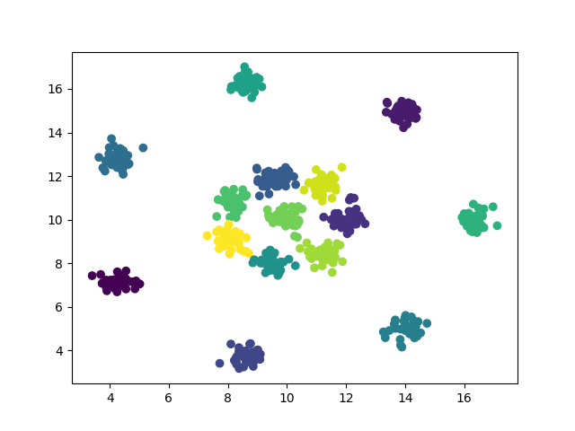

# Algoritmo k-Means
 
Também conhecido como Isodata ou CMeans, é o algoritmo mais conhecido e utilizado para o agrupamento de dados e
apoio a outros algoritmos que possuem alto custo computacional
 

